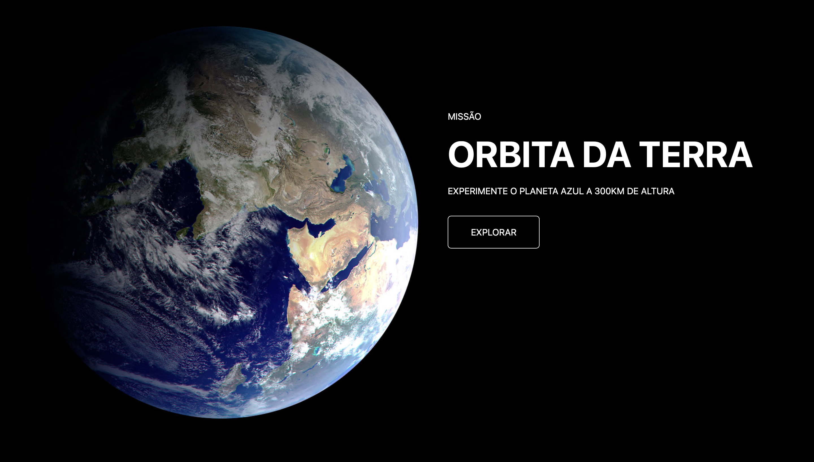

<h1>SpaceX</h1>

> Project Status: Finished (May 25, 2023)

### Topics

:small_blue_diamond: [Project Description](#project-description)

:small_blue_diamond: [Features](#features)

:small_blue_diamond: [Dependencies](#dependencies)

:small_blue_diamond: [Run App](#run-application)

## Project Description

<p align="justify">
  SpaceX inspired application. The main idea was to develop a application using only HTML, SCSS and Bootstrap.
</p>

## Features

:heavy_check_mark: Pages and animations

## Dependencies

:warning: Node
<br>
:warning: HTML
<br>
:warning: BootStrap
<br>
:warning: SASS/SCSS
<br>
:warning: AOS Animations




## Run application:

Clone project:

```
git clone https://github.com/EnzoBozzani/spacex.git
```

Install dependencies:

```
npm install
```

Run project:

```
npm run dev
```
